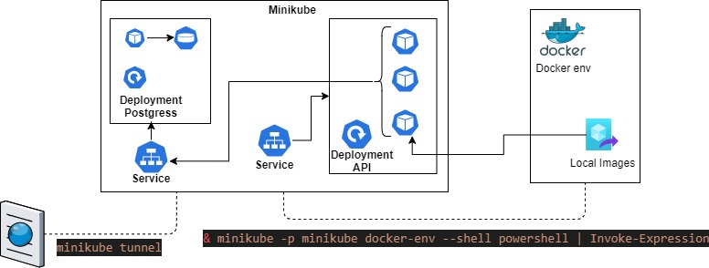

# README
## Docker

    * cd make/docker
    * make build_run

## Docker compose
    * cd make/docker_compose
    * make up

## Kubernets
    

    * minikube start
    * minikube -p minikube docker-env --shell powershell | Invoke-Expression
    * minikube tunnel (in other window)
    * cd make/Kubernets
    * make postgres
    * make api-service

## Terraform GCE
    * cd terraform_gce
    * terraform init
    * terraform validate
    * terraform plan -var-file="dev.tfvars"
    * terraform apply -var-file="dev.tfvars" --auto-approve

## Terraform GCK
    ### Submit docker to Docker hub
        * cd make/docker
        * make build_up
        * docker login
        * docker tag app:lastest stuestag/api-test:latest
        * docker push stuestag/api-test:latest
    ### Terraform
    * cd ../..
    * cd terraform_gck
    * terraform init
    * terraform apply --auto-approve

